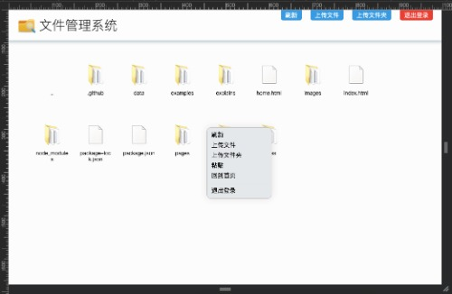

# [File System](https://github.com/fragement-contrib/FileSystem)
文件管理系统

> 本系统主要基于[NestJS](https://www.nestjs.com.cn/)开发！



## 如何使用？

开发的时候，直接运行如下命令：

```
npm run start:dev
```

然后浏览器访问： ```http://127.0.0.1:30000/index.html```

开发完毕以后，需要发布的话，首先进行打包：

```
npm run build
```

然后启动：

```
npm run start:prod
```

## 版权

MIT License

Copyright (c) [zxl20070701](https://zxl20070701.github.io/notebook/home.html) 走一步，再走一步